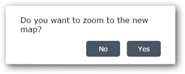
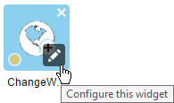

# ChangeWebMap-Widget 1.2
The ChangeWebMap Widget for ArcGIS Web AppBuilder allows users to switch the map content to another web map.

##Using the Widget
The ChangeWebMap Widget is an in-panel widget that will be displayed in the toolbar of your WebApp Builder application. Click the  icon display the Change Web Map panel. 

###Public Content Tab ###
The Public Content tab lists the web maps that are accessible to every one. When configuring the ChangeWebMap widget, the site administrator can filter the list of available web maps to a particular group or type.

###My Content Tab ###
The My Content tab lists the web maps that are accessible to the current user. The first time the tab is displayed, you will need to sign into your Portal account.

Once logged in, the web maps accessible to your account will be displayed in the My Content tab.

###Changing the Web Map ###
To change the map contents to another web map, click the web map in the list.

You will be prompted to Zoom In.

Choose *No* to keep the current map extents or *Yes* to zoom to the extents of the new web map.

Click the More Details link to open a browser window to the information page for the web map.

## Adding the Widget to the Web AppBuilder
To add this widget to your ArcGIS WebApp Builder, 

* download the zip file of the widget
* unzip the contents into client\stemapp\widgets\ChangeWebMap directory

* edit the \client\stemapp\config.json and enter the ChangeWebMap widget in the widgets entry

Example:

	"widgets": [  
        {
            "uri": "widgets/ChangeWebMap/Widget"
        }
    	...
    ]

## Configuring the Widget
Using the Web AppBuilder, click the edit icon on the ChangeWebMap widget in the in-panel widgets to display the Configure Dialog.

The Configure Dialog displays a json file of settings for the widget

Settings for the widget include
**portalUrl** = the url to the Portal for ArcGIS or ArcGIS Online organizational account to sign into for My Content.

**publicContent - query** = is a portal query that selects the groups and map types to display in the public content list. Use the  [Search Reference](http://resources.arcgis.com/en/help/arcgis-rest-api/index.html#/Search_reference/02r3000000mn000000/) to get the syntax for the query. You can test searches using the REST api for Portal available at http://[ServerName]/arcgis/sharing/search before entering them in the widget configuration.

##Sponsors
**Thanks to the City of Garland, Texas for sponsoring the initial development of the ChangeWebMap Widget and releasing it to the community.**
 